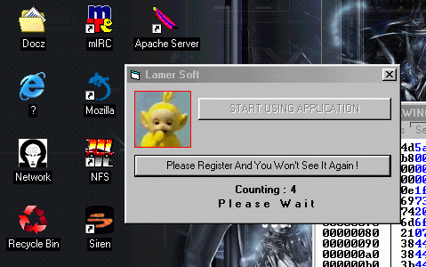



## Decreasing Counter  \- Kill Timer In Exe

### Description

INTENDED ONLY FOR EDUCATIONAL PURPORSES! USE IT AT YOUR OWN RISK! 

Yeah, don't forget to backup your dll :) 

Patching msvbvm60.dll <-

 HEX's View On It :)

 How to find string and replace it with hex editor
 
### More Info
 

             |
---                |---
**Submitted On**   |
**By**             |[Lo$tClu$ter](https://github.com/Planet-Source-Code/PSCIndex/blob/master/ByAuthor/lo-tclu-ter.md)
**Level**          |Beginner
**User Rating**    |5.0 (10 globes from 2 users)
**Compatibility**  |VB 6\.0
**Category**       |[Miscellaneous](https://github.com/Planet-Source-Code/PSCIndex/blob/master/ByCategory/miscellaneous__1-1.md)
**World**          |[Visual Basic](https://github.com/Planet-Source-Code/PSCIndex/blob/master/ByWorld/visual-basic.md)
**Archive File**   |

### Source Code

Ok..
 
So what we got ?
 
1. Before application starts we see a very nice
 screen with a decreasing counter.
 5...4.....3...2...1.... Ok -> cOol
 
2. Now we can push a button and use this application..
 Well, I guess we don't want to wait ;)
 So now we'll patch <b>msvbvm60.dll</b>
 Open this dll with hex editor and look
for :<b>57 FF 74 24 14 FF 74 24</b>
 Replace 57 with 50 (push eax)
 :)

